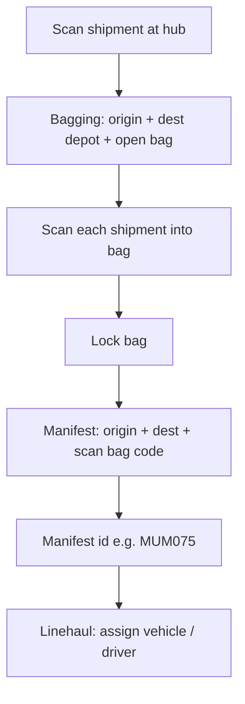
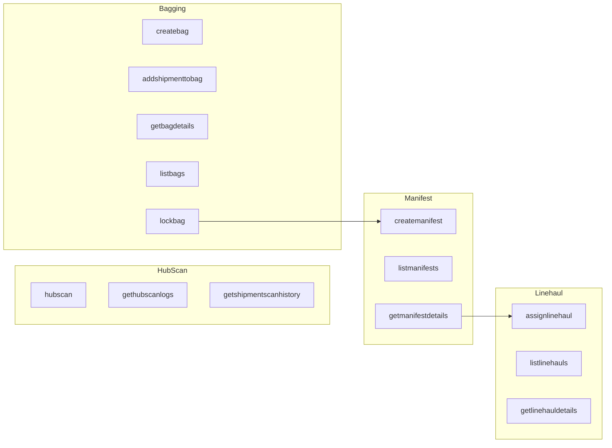

# AXLPL Messenger Services V8 — Outbound APIs

Single reference for **Services V8 outbound** endpoints: categorization, full request contracts, UI flow mapping (admin screenshots / messenger parity), **backend clarification checklist**, and **Flutter implementation** pointers.

---

## Base URL and authentication

| Item | Value |
|------|--------|
| Base URL | `https://my.axlpl.com/messenger/services_v8/` |
| **Production gateway** | `https://my.axlpl.com/messenger/services_v8/api.php?request=<action>` (Postman / iOS app) |
| Flutter client | [`lib/app/data/networking/api_client.dart`](../lib/app/data/networking/api_client.dart) — `getOutbound` / `postOutbound` |
| Auth | `Authorization: Bearer <token>` + `X-App-Version` + `X-App-Platform` |
| Platform param | **Not sent** on verified outbound calls (`appendPlatform: false`). Old path URLs used `?platform=android`. |

**Verified batch 1 (live curls + responses):** [`outbound_batch1_verified.md`](outbound_batch1_verified.md) — regenerate: `./docs/run_batch1_curls.sh`

**Token and user context in the app**

- Token: `Messangerdetail.token` or `Customerdetail.token` from [`LocalStorage.getUserLocalData()`](../lib/app/data/localstorage/local_storage.dart).
- Messenger `user_id`: `Messangerdetail.id`.
- Default `branch_id`: `Messangerdetail.branchId` (string in model; APIs expect numeric branch id where noted — confirm coercion with backend).

**Response shape and live JSON**

- **Master table (all columns):** [`outbound_services_v8_master_table.md`](outbound_services_v8_master_table.md) — **Implemented**, **Working fine**, **Request cURL**, **Raw JSON response** (single-line, not pretty-printed). Regenerate: `python3 scripts/generate_outbound_api_table_with_curl.py` after capture.
- **Full per-endpoint reference (pretty JSON for reading):** [`outbound_services_v8_api_responses_reference.md`](outbound_services_v8_api_responses_reference.md) from [`outbound_v8_api_capture.json`](outbound_v8_api_capture.json).
- Flutter uses helpers in [`outbound_data_parse.dart`](../lib/app/data/models/outbound_data_parse.dart).

### Status columns (all modules)

| Column | Meaning |
|--------|---------|
| **Implemented** | **Yes** = Flutter path constant, `ApiServices` method, `OutboundRepository`, and outbound UI screen action exist. |
| **Working fine** | **Yes** = HTTP 200 with expected body (raw JSON array/object **or** `{success:…}` / `{status:success}`). **Partial** = API reachable; happy path blocked by state (422 already bagged) or missing optional field (`createbag` needs `shipment_ids`). **No** = not verified. |
| **Request cURL** | Example `curl` matching capture URL/body (replace `$OUTBOUND_BEARER_TOKEN`). See master table for full command per API. |
| **Raw JSON response** | Exact `raw_body` from capture as one line (no indentation). See master table. |

Source: [`outbound_v8_api_capture.summary.json`](outbound_v8_api_capture.summary.json). Re-capture with `OUTBOUND_BEARER_TOKEN` or `OUTBOUND_LOGIN_*`, then `python3 scripts/generate_outbound_api_table_with_curl.py`.

| # | Path | Implemented | Working fine |
|---|------|:-----------:|:------------:|
| 1 | `hubscan` | Yes | **Yes** |
| 2 | `gethubscanlogs` | Yes | **Yes** |
| 3 | `getshipmentscanhistory` | Yes | **Yes** |
| 4 | `createbag` | Yes | **Partial** |
| 5 | `addshipmenttobag` | Yes | **Yes** |
| 6 | `getbagdetails` | Yes | **Yes** |
| 7 | `listbags` | Yes | **Yes** |
| 8 | `removeshipmentfrombag` | Yes | Partial |
| 9 | `lockbag` | Yes | Partial |
| 10 | `rebagshipment` | Yes | Partial |
| 11 | `baggingreport` | Yes | **Yes** |
| 12 | `createmanifest` | Yes | Partial |
| 13 | `getmanifestdetails` | Yes | Partial |
| 14 | `listmanifests` | Yes | **Yes** |
| 15 | `manifestreport` | Yes | **Yes** |
| 16 | `printmanifestdata` | Yes | Partial |
| 17 | `assignlinehaul` | Yes | **Yes** |
| 18 | `listlinehauls` | Yes | **Yes** |
| 19 | `getlinehauldetails` | Yes | Partial |
| 20 | `updatelinehaulstatus` | Yes | Partial |
| 21 | `linehaulreport` | Yes | **Yes** |
| 22 | `sectorpickupscan` | Yes | Partial |
| 23 | `getpickuplist` | Yes | **Yes** |
| 24 | `marknotpicked` | Yes | Partial |
| 25 | `addmissedshipment` | Yes | **Yes** |
| 26 | `pickupreport` | Yes | **Yes** |

---

## Module A — Hub scan (3 APIs)

Verified 2026-05-19 — full curls/responses in [`outbound_batch1_verified.md`](outbound_batch1_verified.md).

| # | Path | Method | Params | Flutter |
|---|------|--------|--------|---------|
| 1 | `hubscan` | POST multipart | `docket_no`, `branch_id`, `user_id`, `status` | `ApiServices.hubScan` → FormData, no platform |
| 2 | `gethubscanlogs` | GET | `branch_id`, `limit` | `ApiServices.getHubScanLogs` |
| 3 | `getshipmentscanhistory` | GET | `docket_no` | `ApiServices.getShipmentScanHistory` |

**QA IDs:** docket `558751776258671`, branch `73`.

**Response shapes (no envelope):**
- `hubscan` → `{"success":"Shipment scanned successfully","shipment_id":"…","docket_no":"…"}`
- `gethubscanlogs` → JSON **array** of `{id, shipment_id, scan_type, branch_id, scanned_at, box_no, shipment_invoice_no, …}`
- `getshipmentscanhistory` → JSON **array** of `{id, s_id, status, branch_id, created_date, remark, …}`

**Example — hubscan**
```bash
curl --location --request POST 'https://my.axlpl.com/messenger/services_v8/api.php?request=hubscan' \
  --header 'Authorization: Bearer $TOKEN' \
  --header 'X-App-Version: 22.1.0' \
  --header 'X-App-Platform: ios' \
  --form 'docket_no=558751776258671' \
  --form 'branch_id=73' \
  --form 'user_id=1' \
  --form 'status=Hub In'
```

**Example — gethubscanlogs**
```bash
curl --location --request GET 'https://my.axlpl.com/messenger/services_v8/api.php?request=gethubscanlogs&branch_id=73&limit=50' \
  --header 'Authorization: Bearer $TOKEN' \
  --header 'X-App-Version: 22.1.0' \
  --header 'X-App-Platform: ios'
```

**Example — getshipmentscanhistory**
```bash
curl --location --request GET 'https://my.axlpl.com/messenger/services_v8/api.php?request=getshipmentscanhistory&docket_no=558751776258671' \
  --header 'Authorization: Bearer $TOKEN' \
  --header 'X-App-Version: 22.1.0' \
  --header 'X-App-Platform: ios'
```

---

## Module B — Bagging (batch 1: APIs 4–7 verified)

Verified 2026-05-19 — [`outbound_batch1_verified.md`](outbound_batch1_verified.md).

| # | Path | Method | Params | Notes |
|---|------|--------|--------|-------|
| 4 | `createbag` | POST multipart | `origin_branch_id`, `destination_branch_id`, `bag_code`, **`metal_seal_no`**, `user_id`, optional `shipment_ids` | Without `metal_seal_no` → 400. Without shipments → 400. |
| 5 | `addshipmenttobag` | POST multipart | **`bag_code`**, `docket_no`, `branch_id`, `user_id` | Use `bag_code` not `bag_id`. 422 if already bagged. |
| 6 | `getbagdetails` | GET | **`bag_code`** query | Returns bag + `items[]` shipments. |
| 7 | `listbags` | GET | `branch_id` | JSON **array** of bags at origin depot. |

**QA IDs:** bag `BAG20260518152744831`, bagging docket `825411779084407`, list branch `75`.

**Example — addshipmenttobag**
```bash
curl --location --request POST 'https://my.axlpl.com/messenger/services_v8/api.php?request=addshipmenttobag' \
  --header 'Authorization: Bearer $TOKEN' \
  --header 'X-App-Version: 22.1.0' \
  --header 'X-App-Platform: ios' \
  --form 'bag_code=BAG20260518152744831' \
  --form 'docket_no=825411779084407' \
  --form 'branch_id=1' \
  --form 'user_id=1'
```

**Example — getbagdetails** (response includes `items`, `metal_seal_no`, `manifest_status`)
```bash
curl --location --request GET 'https://my.axlpl.com/messenger/services_v8/api.php?request=getbagdetails&bag_code=BAG20260518152744831' \
  --header 'Authorization: Bearer $TOKEN' \
  --header 'X-App-Version: 22.1.0' \
  --header 'X-App-Platform: ios'
```

**Example — listbags**
```bash
curl --location --request GET 'https://my.axlpl.com/messenger/services_v8/api.php?request=listbags&branch_id=75' \
  --header 'Authorization: Bearer $TOKEN' \
  --header 'X-App-Version: 22.1.0' \
  --header 'X-App-Platform: ios'
```

**Example — createbag**
```bash
curl --location --request POST 'https://my.axlpl.com/messenger/services_v8/api.php?request=createbag' \
  --header 'Authorization: Bearer $TOKEN' \
  --header 'X-App-Version: 22.1.0' \
  --header 'X-App-Platform: ios' \
  --form 'origin_branch_id=37' \
  --form 'destination_branch_id=75' \
  --form 'bag_code=BAG_NEW_CODE' \
  --form 'metal_seal_no=MSeal825411779084407' \
  --form 'user_id=1'
```

### Bagging APIs 8–11 (batch 2 — pending verify in doc)

Legacy table below; update when batch 2 curls are run.

<table>
<thead><tr><th>#</th><th>Name</th><th>Method</th><th>Path</th><th>Request</th><th>Implemented</th><th>Working fine</th><th>Request cURL</th><th>Raw JSON response</th></tr></thead>
<tbody>
<tr><td>4</td><td>Create Bag</td><td>POST</td><td><code>createbag</code></td><td>`origin_branch_id`, `destination_branch_id`, `bag_code`, **`metal_seal_no`**, `user_id`</td><td>Yes</td><td>Partial</td><td>See batch 1 doc</td><td>`metal_seal_no` required; may need `shipment_ids`</td></tr>
<tr><td>5</td><td>Add Shipment To Bag</td><td>POST</td><td><code>addshipmenttobag</code></td><td>**`bag_code`**, `docket_no`, `branch_id`, `user_id`</td><td>Yes</td><td>Yes</td><td>See batch 1 doc</td><td>422 if already bagged (API OK)</td></tr>
<tr><td>6</td><td>Get Bag Details</td><td>GET</td><td><code>getbagdetails</code></td><td>Query: **`bag_code`**</td><td>Yes</td><td>Yes</td><td>See batch 1 doc</td><td>Raw object + `items[]`</td></tr>
<tr><td>7</td><td>List Bags</td><td>GET</td><td><code>listbags</code></td><td>Query: `branch_id`</td><td>Yes</td><td>Yes</td><td>See batch 1 doc</td><td>Raw JSON array</td></tr>
<tr><td>8</td><td>Remove Shipment From Bag</td><td>POST</td><td><code>removeshipmentfrombag</code></td><td>`bag_id`, `docket_no`, `branch_id`, `user_id`</td><td>Yes</td><td>Partial</td><td><pre style="white-space:pre-wrap;word-break:break-all;font-size:11px;margin:0">curl -sS -X POST 'https://my.axlpl.com/messenger/services_v8/removeshipmentfrombag?platform=android' \
  -H 'Authorization: Bearer $OUTBOUND_BEARER_TOKEN' \
  -H 'X-App-Version: 99.99.99' \
  -H 'X-App-Platform: android' \
  -H 'accept: */*' \
  -H 'Content-Type: application/x-www-form-urlencoded' \
  --data 'bag_id=BAG20260515154014&amp;docket_no=990831778839479&amp;branch_id=27&amp;user_id=143&amp;platform=android'</pre></td><td><pre style="white-space:pre-wrap;word-break:break-all;font-size:11px;margin:0">{&quot;status&quot;:&quot;fail&quot;,&quot;message&quot;:&quot;Bag ID and Docket Number required&quot;,&quot;data&quot;:{},&quot;error_code&quot;:400}</pre></td></tr>
<tr><td>9</td><td>Lock Bag</td><td>POST</td><td><code>lockbag</code></td><td>`bag_id`</td><td>Yes</td><td>Partial</td><td><pre style="white-space:pre-wrap;word-break:break-all;font-size:11px;margin:0">curl -sS -X POST 'https://my.axlpl.com/messenger/services_v8/lockbag?platform=android' \
  -H 'Authorization: Bearer $OUTBOUND_BEARER_TOKEN' \
  -H 'X-App-Version: 99.99.99' \
  -H 'X-App-Platform: android' \
  -H 'accept: */*' \
  -H 'Content-Type: application/x-www-form-urlencoded' \
  --data 'bag_id=BAG20260515154014&amp;platform=android'</pre></td><td><pre style="white-space:pre-wrap;word-break:break-all;font-size:11px;margin:0">{&quot;status&quot;:&quot;fail&quot;,&quot;message&quot;:&quot;Bag ID required&quot;,&quot;data&quot;:{},&quot;error_code&quot;:400}</pre></td></tr>
<tr><td>10</td><td>Rebag Shipment</td><td>POST</td><td><code>rebagshipment</code></td><td>`new_bag_id`, `docket_no`, `user_id`</td><td>Yes</td><td>Partial</td><td><pre style="white-space:pre-wrap;word-break:break-all;font-size:11px;margin:0">curl -sS -X POST 'https://my.axlpl.com/messenger/services_v8/rebagshipment?platform=android' \
  -H 'Authorization: Bearer $OUTBOUND_BEARER_TOKEN' \
  -H 'X-App-Version: 99.99.99' \
  -H 'X-App-Platform: android' \
  -H 'accept: */*' \
  -H 'Content-Type: application/x-www-form-urlencoded' \
  --data 'new_bag_id=BAG20260515154014&amp;docket_no=990831778839479&amp;user_id=143&amp;platform=android'</pre></td><td><pre style="white-space:pre-wrap;word-break:break-all;font-size:11px;margin:0">{&quot;status&quot;:&quot;fail&quot;,&quot;message&quot;:&quot;New Bag ID and Docket Number required&quot;,&quot;data&quot;:{},&quot;error_code&quot;:400}</pre></td></tr>
<tr><td>11</td><td>Bagging Report</td><td>GET</td><td><code>baggingreport</code></td><td>Query: `start_date`, `end_date`</td><td>Yes</td><td>Yes</td><td><pre style="white-space:pre-wrap;word-break:break-all;font-size:11px;margin:0">curl -sS -X GET 'https://my.axlpl.com/messenger/services_v8/baggingreport?start_date=2026-01-01&amp;end_date=2026-05-15&amp;platform=android' \
  -H 'Authorization: Bearer $OUTBOUND_BEARER_TOKEN' \
  -H 'X-App-Version: 99.99.99' \
  -H 'X-App-Platform: android' \
  -H 'accept: */*'</pre></td><td><pre style="white-space:pre-wrap;word-break:break-all;font-size:11px;margin:0">{&quot;status&quot;:&quot;success&quot;,&quot;message&quot;:&quot;Bagging report generated&quot;,&quot;data&quot;:{}}</pre></td></tr>
</tbody></table>


---

## Module C — Manifest (5 APIs)

<table>
<thead><tr><th>#</th><th>Name</th><th>Method</th><th>Path</th><th>Request</th><th>Implemented</th><th>Working fine</th><th>Request cURL</th><th>Raw JSON response</th></tr></thead>
<tbody>
<tr><td>12</td><td>Create Manifest</td><td>POST</td><td><code>createmanifest</code></td><td>`bag_ids`, branches, `user_id`</td><td>Yes</td><td>Partial</td><td><pre style="white-space:pre-wrap;word-break:break-all;font-size:11px;margin:0">curl -sS -X POST 'https://my.axlpl.com/messenger/services_v8/createmanifest?platform=android' \
  -H 'Authorization: Bearer $OUTBOUND_BEARER_TOKEN' \
  -H 'X-App-Version: 99.99.99' \
  -H 'X-App-Platform: android' \
  -H 'accept: */*' \
  -H 'Content-Type: application/x-www-form-urlencoded' \
  --data 'bag_ids=BAG20260515154014&amp;origin_branch_id=27&amp;destination_branch_id=27&amp;user_id=143&amp;platform=android'</pre></td><td><pre style="white-space:pre-wrap;word-break:break-all;font-size:11px;margin:0">{&quot;status&quot;:&quot;fail&quot;,&quot;message&quot;:&quot;Invalid Bag IDs format&quot;,&quot;data&quot;:{},&quot;error_code&quot;:400}</pre></td></tr>
<tr><td>13</td><td>Get Manifest Details</td><td>GET</td><td><code>getmanifestdetails</code></td><td>Query: `manifest_id`</td><td>Yes</td><td>Partial</td><td><pre style="white-space:pre-wrap;word-break:break-all;font-size:11px;margin:0">curl -sS -X GET 'https://my.axlpl.com/messenger/services_v8/getmanifestdetails?manifest_id=MUM075&amp;platform=android' \
  -H 'Authorization: Bearer $OUTBOUND_BEARER_TOKEN' \
  -H 'X-App-Version: 99.99.99' \
  -H 'X-App-Platform: android' \
  -H 'accept: */*'</pre></td><td><pre style="white-space:pre-wrap;word-break:break-all;font-size:11px;margin:0">{&quot;status&quot;:&quot;fail&quot;,&quot;message&quot;:&quot;Manifest ID required&quot;,&quot;data&quot;:{},&quot;error_code&quot;:400}</pre></td></tr>
<tr><td>14</td><td>List Manifests</td><td>GET</td><td><code>listmanifests</code></td><td>Query: `branch_id`</td><td>Yes</td><td>Yes</td><td><pre style="white-space:pre-wrap;word-break:break-all;font-size:11px;margin:0">curl -sS -X GET 'https://my.axlpl.com/messenger/services_v8/listmanifests?branch_id=27&amp;platform=android' \
  -H 'Authorization: Bearer $OUTBOUND_BEARER_TOKEN' \
  -H 'X-App-Version: 99.99.99' \
  -H 'X-App-Platform: android' \
  -H 'accept: */*'</pre></td><td><pre style="white-space:pre-wrap;word-break:break-all;font-size:11px;margin:0">{&quot;status&quot;:&quot;success&quot;,&quot;message&quot;:&quot;Manifests retrieved&quot;,&quot;data&quot;:{}}</pre></td></tr>
<tr><td>15</td><td>Manifest Report</td><td>GET</td><td><code>manifestreport</code></td><td>Query: dates</td><td>Yes</td><td>Yes</td><td><pre style="white-space:pre-wrap;word-break:break-all;font-size:11px;margin:0">curl -sS -X GET 'https://my.axlpl.com/messenger/services_v8/manifestreport?start_date=2026-01-01&amp;end_date=2026-05-15&amp;platform=android' \
  -H 'Authorization: Bearer $OUTBOUND_BEARER_TOKEN' \
  -H 'X-App-Version: 99.99.99' \
  -H 'X-App-Platform: android' \
  -H 'accept: */*'</pre></td><td><pre style="white-space:pre-wrap;word-break:break-all;font-size:11px;margin:0">{&quot;status&quot;:&quot;success&quot;,&quot;message&quot;:&quot;Manifest report generated&quot;,&quot;data&quot;:{}}</pre></td></tr>
<tr><td>16</td><td>Print Manifest Data</td><td>GET</td><td><code>printmanifestdata</code></td><td>Query: `manifest_id`</td><td>Yes</td><td>Partial</td><td><pre style="white-space:pre-wrap;word-break:break-all;font-size:11px;margin:0">curl -sS -X GET 'https://my.axlpl.com/messenger/services_v8/printmanifestdata?manifest_id=MUM075&amp;platform=android' \
  -H 'Authorization: Bearer $OUTBOUND_BEARER_TOKEN' \
  -H 'X-App-Version: 99.99.99' \
  -H 'X-App-Platform: android' \
  -H 'accept: */*'</pre></td><td><pre style="white-space:pre-wrap;word-break:break-all;font-size:11px;margin:0">{&quot;status&quot;:&quot;fail&quot;,&quot;message&quot;:&quot;Manifest ID required&quot;,&quot;data&quot;:{},&quot;error_code&quot;:400}</pre></td></tr>
</tbody></table>


---

## Module D — Linehaul (5 APIs)

<table>
<thead><tr><th>#</th><th>Name</th><th>Method</th><th>Path</th><th>Request</th><th>Implemented</th><th>Working fine</th><th>Request cURL</th><th>Raw JSON response</th></tr></thead>
<tbody>
<tr><td>17</td><td>Assign Linehaul</td><td>POST</td><td><code>assignlinehaul</code></td><td>`manifest_ids`, `vehicle_no`, `driver_name`, `user_id`</td><td>Yes</td><td>Yes</td><td><pre style="white-space:pre-wrap;word-break:break-all;font-size:11px;margin:0">curl -sS -X POST 'https://my.axlpl.com/messenger/services_v8/assignlinehaul?platform=android' \
  -H 'Authorization: Bearer $OUTBOUND_BEARER_TOKEN' \
  -H 'X-App-Version: 99.99.99' \
  -H 'X-App-Platform: android' \
  -H 'accept: */*' \
  -H 'Content-Type: application/x-www-form-urlencoded' \
  --data 'manifest_ids=MUM075&amp;vehicle_no=UP78AB1234&amp;driver_name=API+Capture+Script&amp;user_id=143&amp;platform=android'</pre></td><td><pre style="white-space:pre-wrap;word-break:break-all;font-size:11px;margin:0">{&quot;status&quot;:&quot;success&quot;,&quot;message&quot;:&quot;Linehaul assigned&quot;,&quot;data&quot;:{&quot;linehaul_id&quot;:0,&quot;trip_no&quot;:&quot;LH1778841961&quot;}}</pre></td></tr>
<tr><td>18</td><td>List Linehauls</td><td>GET</td><td><code>listlinehauls</code></td><td>Query: `status`</td><td>Yes</td><td>Yes</td><td><pre style="white-space:pre-wrap;word-break:break-all;font-size:11px;margin:0">curl -sS -X GET 'https://my.axlpl.com/messenger/services_v8/listlinehauls?status=In+Transit&amp;platform=android' \
  -H 'Authorization: Bearer $OUTBOUND_BEARER_TOKEN' \
  -H 'X-App-Version: 99.99.99' \
  -H 'X-App-Platform: android' \
  -H 'accept: */*'</pre></td><td><pre style="white-space:pre-wrap;word-break:break-all;font-size:11px;margin:0">{&quot;status&quot;:&quot;success&quot;,&quot;message&quot;:&quot;Linehauls retrieved&quot;,&quot;data&quot;:{}}</pre></td></tr>
<tr><td>19</td><td>Get Linehaul Details</td><td>GET</td><td><code>getlinehauldetails</code></td><td>Query: `linehaul_id`</td><td>Yes</td><td>Partial</td><td><pre style="white-space:pre-wrap;word-break:break-all;font-size:11px;margin:0">curl -sS -X GET 'https://my.axlpl.com/messenger/services_v8/getlinehauldetails?linehaul_id=LH1778841961&amp;platform=android' \
  -H 'Authorization: Bearer $OUTBOUND_BEARER_TOKEN' \
  -H 'X-App-Version: 99.99.99' \
  -H 'X-App-Platform: android' \
  -H 'accept: */*'</pre></td><td><pre style="white-space:pre-wrap;word-break:break-all;font-size:11px;margin:0">{&quot;status&quot;:&quot;fail&quot;,&quot;message&quot;:&quot;Linehaul ID required&quot;,&quot;data&quot;:{},&quot;error_code&quot;:400}</pre></td></tr>
<tr><td>20</td><td>Update Linehaul Status</td><td>POST</td><td><code>updatelinehaulstatus</code></td><td>`linehaul_id`, `status`, `user_id`, `branch_id`</td><td>Yes</td><td>Partial</td><td><pre style="white-space:pre-wrap;word-break:break-all;font-size:11px;margin:0">curl -sS -X POST 'https://my.axlpl.com/messenger/services_v8/updatelinehaulstatus?platform=android' \
  -H 'Authorization: Bearer $OUTBOUND_BEARER_TOKEN' \
  -H 'X-App-Version: 99.99.99' \
  -H 'X-App-Platform: android' \
  -H 'accept: */*' \
  -H 'Content-Type: application/x-www-form-urlencoded' \
  --data 'linehaul_id=LH1778841961&amp;status=ARRIVED&amp;user_id=143&amp;branch_id=27&amp;platform=android'</pre></td><td><pre style="white-space:pre-wrap;word-break:break-all;font-size:11px;margin:0">{&quot;status&quot;:&quot;fail&quot;,&quot;message&quot;:&quot;Linehaul ID and Status required&quot;,&quot;data&quot;:{},&quot;error_code&quot;:400}</pre></td></tr>
<tr><td>21</td><td>Linehaul Report</td><td>GET</td><td><code>linehaulreport</code></td><td>Query: dates</td><td>Yes</td><td>Yes</td><td><pre style="white-space:pre-wrap;word-break:break-all;font-size:11px;margin:0">curl -sS -X GET 'https://my.axlpl.com/messenger/services_v8/linehaulreport?start_date=2026-01-01&amp;end_date=2026-05-15&amp;platform=android' \
  -H 'Authorization: Bearer $OUTBOUND_BEARER_TOKEN' \
  -H 'X-App-Version: 99.99.99' \
  -H 'X-App-Platform: android' \
  -H 'accept: */*'</pre></td><td><pre style="white-space:pre-wrap;word-break:break-all;font-size:11px;margin:0">{&quot;status&quot;:&quot;success&quot;,&quot;message&quot;:&quot;Linehaul report generated&quot;,&quot;data&quot;:{}}</pre></td></tr>
</tbody></table>


---

## Module E — Sector pickup (5 APIs)

<table>
<thead><tr><th>#</th><th>Name</th><th>Method</th><th>Path</th><th>Request</th><th>Implemented</th><th>Working fine</th><th>Request cURL</th><th>Raw JSON response</th></tr></thead>
<tbody>
<tr><td>22</td><td>Sector Pickup Scan</td><td>POST</td><td><code>sectorpickupscan</code></td><td>`pickup_id`, `docket_no`, `status`, `remarks`, ids</td><td>Yes</td><td>Partial</td><td><pre style="white-space:pre-wrap;word-break:break-all;font-size:11px;margin:0">curl -sS -X POST 'https://my.axlpl.com/messenger/services_v8/sectorpickupscan?platform=android' \
  -H 'Authorization: Bearer $OUTBOUND_BEARER_TOKEN' \
  -H 'X-App-Version: 99.99.99' \
  -H 'X-App-Platform: android' \
  -H 'accept: */*' \
  -H 'Content-Type: application/x-www-form-urlencoded' \
  --data 'pickup_id=122&amp;docket_no=990831778839479&amp;status=Picked&amp;remarks=&amp;user_id=143&amp;branch_id=27&amp;platform=android'</pre></td><td><pre style="white-space:pre-wrap;word-break:break-all;font-size:11px;margin:0">{&quot;status&quot;:&quot;fail&quot;,&quot;message&quot;:&quot;Shipment already scanned for this pickup&quot;,&quot;data&quot;:{},&quot;error_code&quot;:422}</pre></td></tr>
<tr><td>23</td><td>Get Pickup List</td><td>GET</td><td><code>getpickuplist</code></td><td>`platform` only</td><td>Yes</td><td>Yes</td><td><pre style="white-space:pre-wrap;word-break:break-all;font-size:11px;margin:0">curl -sS -X GET 'https://my.axlpl.com/messenger/services_v8/getpickuplist?platform=android' \
  -H 'Authorization: Bearer $OUTBOUND_BEARER_TOKEN' \
  -H 'X-App-Version: 99.99.99' \
  -H 'X-App-Platform: android' \
  -H 'accept: */*'</pre></td><td><pre style="white-space:pre-wrap;word-break:break-all;font-size:11px;margin:0">{&quot;status&quot;:&quot;success&quot;,&quot;message&quot;:&quot;Pickup list retrieved&quot;,&quot;data&quot;:[{&quot;id&quot;:&quot;122&quot;,&quot;mawb_no&quot;:&quot;mum4321&quot;,&quot;hub_id&quot;:&quot;1&quot;,&quot;picked_by&quot;:null,&quot;pickup_date&quot;:&quot;2026-05-15&quot;,&quot;pickup_time&quot;:&quot;15:49:00&quot;,&quot;created_at&quot;:&quot;2026-05-15 15:50:04&quot;,&quot;updated_at&quot;:&quot;2026-05-15 15:50:04&quot;},{&quot;id&quot;:&quot;121&quot;,&quot;mawb_no&quot;:&quot;awb1234&quot;,&quot;hub_id&quot;:&quot;1&quot;,&quot;picked_by&quot;:null,&quot;pickup_date&quot;:&quot;2026-05-15&quot;,&quot;pickup_time&quot;:&quot;15:20:00&quot;,&quot;created_at&quot;:&quot;2026-05-15 15:20:32&quot;,&quot;updated_at&quot;:&quot;2026-05-15 15:20:34&quot;},{&quot;id&quot;:&quot;120&quot;,&quot;mawb_no&quot;:&quot;0001&quot;,&quot;hub_id&quot;:&quot;1&quot;,&quot;picked_by&quot;:null,&quot;pickup_date&quot;:&quot;2026-05-15&quot;,&quot;pickup_time&quot;:&quot;14:41:00&quot;,&quot;created_at&quot;:&quot;2026-05-15 14:43:04&quot;,&quot;updated_at&quot;:&quot;2026-05-15 14:43:04&quot;},{&quot;id&quot;:&quot;119&quot;,&quot;mawb_no&quot;:&quot;MH02FG43141778772483&quot;,&quot;hub_id&quot;:&quot;1&quot;,&quot;picked_by&quot;:null,&quot;pickup_date&quot;:&quot;2026-05-15&quot;,&quot;pickup_time&quot;:&quot;15:34:00&quot;,&quot;created_at&quot;:&quot;2026-05-15 12:42:22&quot;,&quot;updated_at&quot;:&quot;2026-05-15 15:34:05&quot;},{&quot;id&quot;:&quot;118&quot;,&quot;mawb_no&quot;:&quot;31227879541&quot;,&quot;hub_id&quot;:&quot;1&quot;,&quot;picked_by&quot;:null,&quot;pickup_date&quot;:&quot;2026-05-15&quot;,&quot;pickup_time&quot;:&quot;14:45:00&quot;,&quot;created_at&quot;:&quot;2026-05-15 12:39:51&quot;,&quot;updated_at&quot;:&quot;2026-05-15 14:45:12&quot;},{&quot;id&quot;:&quot;117&quot;,&quot;mawb_no&quot;:&quot;09805370654&quot;,&quot;hub_id&quot;:&quot;1&quot;,&quot;picked_by&quot;:null,&quot;pickup_date&quot;:&quot;2026-05-15&quot;,&quot;pickup_time&quot;:&quot;13:53:00&quot;,&quot;created_at&quot;:&quot;2026-05-15 12:37:53&quot;,&quot;updated_at&quot;:&quot;2026-05-15 13:56:23&quot;},{&quot;id&quot;:&quot;116&quot;,&quot;mawb_no&quot;:&quot;31227937291&quot;,&quot;hub_id&quot;:&quot;1&quot;,&quot;picked_by&quot;:null,&quot;pickup_date&quot;:&quot;2026-05-15&quot;,&quot;pickup_time&quot;:&quot;15:47:00&quot;,&quot;created_at&quot;:&quot;2026-05-15 12:10:29&quot;,&quot;updated_at&quot;:&quot;2026-05-15 15:48:07&quot;},{&quot;id&quot;:&quot;115&quot;,&quot;mawb_no&quot;:&quot;31227935456&quot;,&quot;hub_id&quot;:&quot;1&quot;,&quot;picked_by&quot;:null,&quot;pickup_date&quot;:&quot;2026-05-15&quot;,&quot;pickup_time&quot;:&quot;12:37:00&quot;,&quot;created_at&quot;:&quot;2026-05-15 11:55:56&quot;,&quot;updated_at&quot;:&quot;2026-05-15 12:41:33&quot;},{&quot;id&quot;:&quot;114&quot;,&quot;mawb_no&quot;:&quot;312-27932376&quot;,&quot;hub_id&quot;:&quot;1&quot;,&quot;picked_by&quot;:null,&quot;pickup_date&quot;:&quot;2026-05-15&quot;,&quot;pickup_time&quot;:&quot;12:42:00&quot;,&quot;created_at&quot;:&quot;2026-05-15 11:54:26&quot;,&quot;updated_at&quot;:&quot;2026-05-15 12:43:43&quot;},{&quot;id&quot;:&quot;113&quot;,&quot;mawb_no&quot;:&quot;27935504&quot;,&quot;hub_id&quot;:&quot;1&quot;,&quot;picked_by&quot;:null,&quot;pickup_date&quot;:&quot;2026-05-15&quot;,&quot;pickup_time&quot;:&quot;12:45:00&quot;,&quot;created_at&quot;:&quot;2026-05-15 11:53:52&quot;,&quot;updated_at&quot;:&quot;2026-05-15 12:45:45&quot;},{&quot;id&quot;:&quot;112&quot;,&quot;mawb_no&quot;:&quot;31227881921&quot;,&quot;hub_id&quot;:&quot;1&quot;,&quot;picked_by&quot;:null,&quot;pickup_date&quot;:&quot;2026-05-15&quot;,&quot;pickup_time&quot;:&quot;13:31:00&quot;,&quot;created_at&quot;:&quot;2026-05-15 11:50:24&quot;,&quot;updated_at&quot;:&quot;2026-05-15 13:32:15&quot;},{&quot;id&quot;:&quot;111&quot;,&quot;mawb_no&quot;:&quot;09803808420&quot;,&quot;hub_id&quot;:&quot;1&quot;,&quot;picked_by&quot;:null,&quot;pickup_date&quot;:&quot;2026-05-15&quot;,&quot;pickup_time&quot;:&quot;12:37:00&quot;,&quot;created_at&quot;:&quot;2026-05-15 11:44:45&quot;,&quot;updated_at&quot;:&quot;2026-05-15 12:40:55&quot;},{&quot;id&quot;:&quot;110&quot;,&quot;mawb_no&quot;:&quot;:312-27943285&quot;,&quot;hub_id&quot;:&quot;1&quot;,&quot;picked_by&quot;:null,&quot;pickup_date&quot;:&quot;2026-05-15&quot;,&quot;pickup_time&quot;:&quot;12:37:00&quot;,&quot;created_at&quot;:&quot;2026-05-15 11:43:43&quot;,&quot;updated_at&quot;:&quot;2026-05-15 12:40:15&quot;},{&quot;id&quot;:&quot;109&quot;,&quot;mawb_no&quot;:&quot;09805749321&quot;,&quot;hub_id&quot;:&quot;1&quot;,&quot;picked_by&quot;:null,&quot;pickup_date&quot;:&quot;2026-05-15&quot;,&quot;pickup_time&quot;:&quot;10:10:00&quot;,&quot;created_at&quot;:&quot;2026-05-15 10:10:48&quot;,&quot;updated_at&quot;:&quot;2026-05-15 10:10:48&quot;},{&quot;id&quot;:&quot;108&quot;,&quot;mawb_no&quot;:&quot;up0461111778757102&quot;,&quot;hub_id&quot;:&quot;1&quot;,&quot;picked_by&quot;:null,&quot;pickup_date&quot;:&quot;2026-05-14&quot;,&quot;pickup_time&quot;:&quot;16:41:00&quot;,&quot;created_at&quot;:&quot;2026-05-14 16:42:02&quot;,&quot;updated_at&quot;:&quot;2026-05-14 16:42:02&quot;},{&quot;id&quot;:&quot;107&quot;,&quot;mawb_no&quot;:&quot;09804579886&quot;,&quot;hub_id&quot;:&quot;1&quot;,&quot;picked_by&quot;:null,&quot;pickup_date&quot;:&quot;2026-05-14&quot;,&quot;pickup_time&quot;:&quot;16:01:00&quot;,&quot;created_at&quot;:&quot;2026-05-14 16:01:23&quot;,&quot;updated_at&quot;:&quot;2026-05-14 16:01:23&quot;},{&quot;id&quot;:&quot;106&quot;,&quot;mawb_no&quot;:&quot;098-05173324&quot;,&quot;hub_id&quot;:&quot;1&quot;,&quot;picked_by&quot;:null,&quot;pickup_date&quot;:&quot;2026-05-14&quot;,&quot;pickup_time&quot;:&quot;12:25:00&quot;,&quot;created_at&quot;:&quot;2026-05-14 12:25:18&quot;,&quot;updated_at&quot;:&quot;2026-05-14 12:25:18&quot;},{&quot;id&quot;:&quot;105&quot;,&quot;mawb_no&quot;:&quot;312-27875621&quot;,&quot;hub_id&quot;:&quot;1&quot;,&quot;picked_by&quot;:null,&quot;pickup_date&quot;:&quot;2026-05-14&quot;,&quot;pickup_time&quot;:&quot;12:15:00&quot;,&quot;created_at&quot;:&quot;2026-05-14 12:15:13&quot;,&quot;updated_at&quot;:&quot;2026-05-14 12:15:13&quot;},{&quot;id&quot;:&quot;104&quot;,&quot;mawb_no&quot;:&quot;MH02FG43141778686644&quot;,&quot;hub_id&quot;:&quot;1&quot;,&quot;picked_by&quot;:null,&quot;pickup_date&quot;:&quot;2026-05-14&quot;,&quot;pickup_time&quot;:&quot;13:38:00&quot;,&quot;created_at&quot;:&quot;2026-05-14 12:08:47&quot;,&quot;updated_at&quot;:&quot;2026-05-14 13:38:55&quot;},{&quot;id&quot;:&quot;103&quot;,&quot;mawb_no&quot;:&quot;31227874663&quot;,&quot;hub_id&quot;:&quot;1&quot;,&quot;picked_by&quot;:null,&quot;pickup_date&quot;:&quot;2026-05-14&quot;,&quot;pickup_time&quot;:&quot;17:06:00&quot;,&quot;created_at&quot;:&quot;2026-05-14 12:05:22&quot;,&quot;updated_at&quot;:&quot;2026-05-14 17:06:27&quot;},{&quot;id&quot;:&quot;102&quot;,&quot;mawb_no&quot;:&quot;31227877776&quot;,&quot;hub_id&quot;:&quot;1&quot;,&quot;picked_by&quot;:null,&quot;pickup_date&quot;:&quot;2026-05-14&quot;,&quot;pickup_time&quot;:&quot;13:38:00&quot;,&quot;created_at&quot;:&quot;2026-05-14 12:04:35&quot;,&quot;updated_at&quot;:&quot;2026-05-14 13:38:09&quot;},{&quot;id&quot;:&quot;101&quot;,&quot;mawb_no&quot;:&quot;AWB23389&quot;,&quot;hub_id&quot;:&quot;1&quot;,&quot;picked_by&quot;:null,&quot;pickup_date&quot;:&quot;2026-05-13&quot;,&quot;pickup_time&quot;:&quot;17:25:00&quot;,&quot;created_at&quot;:&quot;2026-05-13 17:25:40&quot;,&quot;updated_at&quot;:&quot;2026-05-13 17:25:40&quot;},{&quot;id&quot;:&quot;98&quot;,&quot;mawb_no&quot;:&quot;27807150&quot;,&quot;hub_id&quot;:&quot;1&quot;,&quot;picked_by&quot;:null,&quot;pickup_date&quot;:&quot;2026-05-13&quot;,&quot;pickup_time&quot;:&quot;12:31:00&quot;,&quot;created_at&quot;:&quot;2026-05-13 12:26:27&quot;,&quot;updated_at&quot;:&quot;2026-05-13 12:31:57&quot;},{&quot;id&quot;:&quot;97&quot;,&quot;mawb_no&quot;:&quot;31227811781&quot;,&quot;hub_id&quot;:&quot;1&quot;,&quot;picked_by&quot;:null,&quot;pickup_date&quot;:&quot;2026-05-13&quot;,&quot;pickup_time&quot;:&quot;12:32:00&quot;,&quot;created_at&quot;:&quot;2026-05-13 12:25:05&quot;,&quot;updated_at&quot;:&quot;2026-05-13 12:32:49&quot;},{&quot;id&quot;:&quot;96&quot;,&quot;mawb_no&quot;:&quot;312-27816106&quot;,&quot;hub_id&quot;:&quot;1&quot;,&quot;picked_by&quot;:null,&quot;pickup_date&quot;:&quot;2026-05-13&quot;,&quot;pickup_time&quot;:&quot;13:47:00&quot;,&quot;created_at&quot;:&quot;2026-05-13 12:24:43&quot;,&quot;updated_at&quot;:&quot;2026-05-13 13:47:39&quot;},{&quot;id&quot;:&quot;95&quot;,&quot;mawb_no&quot;:&quot;31227817705&quot;,&quot;hub_id&quot;:&quot;1&quot;,&quot;picked_by&quot;:null,&quot;pickup_date&quot;:&quot;2026-05-13&quot;,&quot;pickup_time&quot;:&quot;13:57:00&quot;,&quot;created_at&quot;:&quot;2026-05-13 12:17:17&quot;,&quot;updated_at&quot;:&quot;2026-05-13 13:57:55&quot;},{&quot;id&quot;:&quot;94&quot;,&quot;mawb_no&quot;:&quot;MH02FG43141778598912&quot;,&quot;hub_id&quot;:&quot;1&quot;,&quot;picked_by&quot;:null,&quot;pickup_date&quot;:&quot;2026-05-13&quot;,&quot;pickup_time&quot;:&quot;12:31:00&quot;,&quot;created_at&quot;:&quot;2026-05-13 11:00:08&quot;,&quot;updated_at&quot;:&quot;2026-05-13 12:32:17&quot;},{&quot;id&quot;:&quot;93&quot;,&quot;mawb_no&quot;:&quot;000&quot;,&quot;hub_id&quot;:&quot;1&quot;,&quot;picked_by&quot;:null,&quot;pickup_date&quot;:&quot;2026-05-13&quot;,&quot;pickup_time&quot;:&quot;10:05:00&quot;,&quot;created_at&quot;:&quot;2026-05-13 10:06:07&quot;,&quot;updated_at&quot;:&quot;2026-05-13 10:06:44&quot;},{&quot;id&quot;:&quot;92&quot;,&quot;mawb_no&quot;:&quot;11052026&quot;,&quot;hub_id&quot;:&quot;1&quot;,&quot;picked_by&quot;:null,&quot;pickup_date&quot;:&quot;2026-05-12&quot;,&quot;pickup_time&quot;:&quot;12:52:00&quot;,&quot;created_at&quot;:&quot;2026-05-12 12:52:38&quot;,&quot;updated_at&quot;:&quot;2026-05-12 12:52:38&quot;},{&quot;id&quot;:&quot;91&quot;,&quot;mawb_no&quot;:&quot;31227752734&quot;,&quot;hub_id&quot;:&quot;1&quot;,&quot;picked_by&quot;:null,&quot;pickup_date&quot;:&quot;2026-05-13&quot;,&quot;pickup_time&quot;:&quot;12:17:00&quot;,&quot;created_at&quot;:&quot;2026-05-12 12:09:04&quot;,&quot;updated_at&quot;:&quot;2026-05-13 12:28:36&quot;},{&quot;id&quot;:&quot;90&quot;,&quot;mawb_no&quot;:&quot;31227748276&quot;,&quot;hub_id&quot;:&quot;1&quot;,&quot;picked_by&quot;:null,&quot;pickup_date&quot;:&quot;2026-05-12&quot;,&quot;pickup_time&quot;:&quot;12:52:00&quot;,&quot;created_at&quot;:&quot;2026-05-12 12:07:58&quot;,&quot;updated_at&quot;:&quot;2026-05-12 12:56:03&quot;},{&quot;id&quot;:&quot;89&quot;,&quot;mawb_no&quot;:&quot;312-27755442&quot;,&quot;hub_id&quot;:&quot;1&quot;,&quot;picked_by&quot;:null,&quot;pickup_date&quot;:&quot;2026-05-12&quot;,&quot;pickup_time&quot;:&quot;12:52:00&quot;,&quot;created_at&quot;:&quot;2026-05-12 11:56:15&quot;,&quot;updated_at&quot;:&quot;2026-05-12 12:55:40&quot;},{&quot;id&quot;:&quot;88&quot;,&quot;mawb_no&quot;:&quot;27756142&quot;,&quot;hub_id&quot;:&quot;1&quot;,&quot;picked_by&quot;:null,&quot;pickup_date&quot;:&quot;2026-05-13&quot;,&quot;pickup_time&quot;:&quot;12:33:00&quot;,&quot;created_at&quot;:&quot;2026-05-12 11:41:48&quot;,&quot;updated_at&quot;:&quot;2026-05-13 12:33:30&quot;},{&quot;id&quot;:&quot;87&quot;,&quot;mawb_no&quot;:&quot;MH02FG43141778511581&quot;,&quot;hub_id&quot;:&quot;1&quot;,&quot;picked_by&quot;:null,&quot;pickup_date&quot;:&quot;2026-05-12&quot;,&quot;pickup_time&quot;:&quot;12:52:00&quot;,&quot;created_at&quot;:&quot;2026-05-12 10:56:54&quot;,&quot;updated_at&quot;:&quot;2026-05-12 12:56:50&quot;},{&quot;id&quot;:&quot;86&quot;,&quot;mawb_no&quot;:&quot;09052026&quot;,&quot;hub_id&quot;:&quot;1&quot;,&quot;picked_by&quot;:null,&quot;pickup_date&quot;:&quot;2026-05-13&quot;,&quot;pickup_time&quot;:&quot;15:53:00&quot;,&quot;created_at&quot;:&quot;2026-05-11 15:58:10&quot;,&quot;updated_at&quot;:&quot;2026-05-13 15:53:19&quot;},{&quot;id&quot;:&quot;85&quot;,&quot;mawb_no&quot;:&quot;10052026&quot;,&quot;hub_id&quot;:&quot;1&quot;,&quot;picked_by&quot;:null,&quot;pickup_date&quot;:&quot;2026-05-11&quot;,&quot;pickup_time&quot;:&quot;16:47:00&quot;,&quot;created_at&quot;:&quot;2026-05-11 12:53:39&quot;,&quot;updated_at&quot;:&quot;2026-05-11 16:48:06&quot;},{&quot;id&quot;:&quot;84&quot;,&quot;mawb_no&quot;:&quot;312-27672131&quot;,&quot;hub_id&quot;:&quot;1&quot;,&quot;picked_by&quot;:null,&quot;pickup_date&quot;:&quot;2026-05-11&quot;,&quot;pickup_time&quot;:&quot;12:36:00&quot;,&quot;created_at&quot;:&quot;2026-05-11 12:33:29&quot;,&quot;updated_at&quot;:&quot;2026-05-11 12:36:38&quot;},{&quot;id&quot;:&quot;83&quot;,&quot;mawb_no&quot;:&quot;312-27671733&quot;,&quot;hub_id&quot;:&quot;1&quot;,&quot;picked_by&quot;:null,&quot;pickup_date&quot;:&quot;2026-05-11&quot;,&quot;pickup_time&quot;:&quot;12:19:00&quot;,&quot;created_at&quot;:&quot;2026-05-11 12:09:53&quot;,&quot;updated_at&quot;:&quot;2026-05-11 12:20:25&quot;},{&quot;id&quot;:&quot;82&quot;,&quot;mawb_no&quot;:&quot;31227671582&quot;,&quot;hub_id&quot;:&quot;1&quot;,&quot;picked_by&quot;:null,&quot;pickup_date&quot;:&quot;2026-05-11&quot;,&quot;pickup_time&quot;:&quot;12:19:00&quot;,&quot;created_at&quot;:&quot;2026-05-11 12:08:58&quot;,&quot;updated_at&quot;:&quot;2026-05-11 12:22:35&quot;},{&quot;id&quot;:&quot;81&quot;,&quot;mawb_no&quot;:&quot;09804802033&quot;,&quot;hub_id&quot;:&quot;1&quot;,&quot;picked_by&quot;:null,&quot;pickup_date&quot;:&quot;2026-05-11&quot;,&quot;pickup_time&quot;:&quot;12:19:00&quot;,&quot;created_at&quot;:&quot;2026-05-11 11:33:45&quot;,&quot;updated_at&quot;:&quot;2026-05-11 12:19:49&quot;},{&quot;id&quot;:&quot;80&quot;,&quot;mawb_no&quot;:&quot;MH02FG43141778338146&quot;,&quot;hub_id&quot;:&quot;1&quot;,&quot;picked_by&quot;:null,&quot;pickup_date&quot;:&quot;2026-05-11&quot;,&quot;pickup_time&quot;:&quot;12:19:00&quot;,&quot;created_at&quot;:&quot;2026-05-11 11:06:23&quot;,&quot;updated_at&quot;:&quot;2026-05-11 12:23:01&quot;},{&quot;id&quot;:&quot;79&quot;,&quot;mawb_no&quot;:&quot;0001778429718&quot;,&quot;hub_id&quot;:&quot;1&quot;,&quot;picked_by&quot;:null,&quot;pickup_date&quot;:&quot;2026-05-11&quot;,&quot;pickup_time&quot;:&quot;12:51:00&quot;,&quot;created_at&quot;:&quot;2026-05-11 11:03:21&quot;,&quot;updated_at&quot;:&quot;2026-05-11 12:51:45&quot;},{&quot;id&quot;:&quot;78&quot;,&quot;mawb_no&quot;:&quot;312-27620294&quot;,&quot;hub_id&quot;:&quot;1&quot;,&quot;picked_by&quot;:null,&quot;pickup_date&quot;:&quot;2026-05-09&quot;,&quot;pickup_time&quot;:&quot;14:04:00&quot;,&quot;created_at&quot;:&quot;2026-05-09 12:28:39&quot;,&quot;updated_at&quot;:&quot;2026-05-09 14:04:37&quot;},{&quot;id&quot;:&quot;77&quot;,&quot;mawb_no&quot;:&quot;31227622420&quot;,&quot;hub_id&quot;:&quot;1&quot;,&quot;picked_by&quot;:null,&quot;pickup_date&quot;:&quot;2026-05-11&quot;,&quot;pickup_time&quot;:&quot;12:19:00&quot;,&quot;created_at&quot;:&quot;2026-05-09 12:27:29&quot;,&quot;updated_at&quot;:&quot;2026-05-11 12:23:56&quot;},{&quot;id&quot;:&quot;76&quot;,&quot;mawb_no&quot;:&quot;31227619292&quot;,&quot;hub_id&quot;:&quot;1&quot;,&quot;picked_by&quot;:null,&quot;pickup_date&quot;:&quot;2026-05-09&quot;,&quot;pickup_time&quot;:&quot;14:01:00&quot;,&quot;created_at&quot;:&quot;2026-05-09 12:00:04&quot;,&quot;updated_at&quot;:&quot;2026-05-09 14:01:09&quot;},{&quot;id&quot;:&quot;75&quot;,&quot;mawb_no&quot;:&quot;312-27610682&quot;,&quot;hub_id&quot;:&quot;1&quot;,&quot;picked_by&quot;:null,&quot;pickup_date&quot;:&quot;2026-05-09&quot;,&quot;pickup_time&quot;:&quot;18:54:00&quot;,&quot;created_at&quot;:&quot;2026-05-09 11:50:10&quot;,&quot;updated_at&quot;:&quot;2026-05-09 18:54:58&quot;},{&quot;id&quot;:&quot;74&quot;,&quot;mawb_no&quot;:&quot;31227610295&quot;,&quot;hub_id&quot;:&quot;1&quot;,&quot;picked_by&quot;:null,&quot;pickup_date&quot;:&quot;2026-05-09&quot;,&quot;pickup_time&quot;:&quot;14:03:00&quot;,&quot;created_at&quot;:&quot;2026-05-09 11:49:30&quot;,&quot;updated_at&quot;:&quot;2026-05-09 14:03:57&quot;},{&quot;id&quot;:&quot;73&quot;,&quot;mawb_no&quot;:&quot;27616131&quot;,&quot;hub_id&quot;:&quot;1&quot;,&quot;picked_by&quot;:null,&quot;pickup_date&quot;:&quot;2026-05-09&quot;,&quot;pickup_time&quot;:&quot;12:30:00&quot;,&quot;created_at&quot;:&quot;2026-05-09 11:48:38&quot;,&quot;updated_at&quot;:&quot;2026-05-09 12:31:12&quot;},{&quot;id&quot;:&quot;72&quot;,&quot;mawb_no&quot;:&quot;312-00000000&quot;,&quot;hub_id&quot;:&quot;1&quot;,&quot;picked_by&quot;:null,&quot;pickup_date&quot;:&quot;2026-05-09&quot;,&quot;pickup_time&quot;:&quot;11:03:00&quot;,&quot;created_at&quot;:&quot;2026-05-09 11:03:56&quot;,&quot;updated_at&quot;:&quot;2026-05-09 11:03:56&quot;},{&quot;id&quot;:&quot;71&quot;,&quot;mawb_no&quot;:&quot;DEL TO LKO&quot;,&quot;hub_id&quot;:&quot;1&quot;,&quot;picked_by&quot;:null,&quot;pickup_date&quot;:&quot;2026-05-09&quot;,&quot;pickup_time&quot;:&quot;14:01:00&quot;,&quot;created_at&quot;:&quot;2026-05-09 11:02:00&quot;,&quot;updated_at&quot;:&quot;2026-05-09 14:01:34&quot;}]}</pre></td></tr>
<tr><td>24</td><td>Mark Not Picked</td><td>POST</td><td><code>marknotpicked</code></td><td>`pickup_id`, `docket_no`, `remarks`, ids</td><td>Yes</td><td>Partial</td><td><pre style="white-space:pre-wrap;word-break:break-all;font-size:11px;margin:0">curl -sS -X POST 'https://my.axlpl.com/messenger/services_v8/marknotpicked?platform=android' \
  -H 'Authorization: Bearer $OUTBOUND_BEARER_TOKEN' \
  -H 'X-App-Version: 99.99.99' \
  -H 'X-App-Platform: android' \
  -H 'accept: */*' \
  -H 'Content-Type: application/x-www-form-urlencoded' \
  --data 'pickup_id=122&amp;docket_no=990831778839479&amp;remarks=api_capture_script_test&amp;user_id=143&amp;branch_id=27&amp;platform=android'</pre></td><td><pre style="white-space:pre-wrap;word-break:break-all;font-size:11px;margin:0">{&quot;status&quot;:&quot;fail&quot;,&quot;message&quot;:&quot;Shipment already scanned for this pickup&quot;,&quot;data&quot;:{},&quot;error_code&quot;:422}</pre></td></tr>
<tr><td>25</td><td>Add Missed Shipment</td><td>POST</td><td><code>addmissedshipment</code></td><td>`pickup_id`, `docket_no`, `remarks`</td><td>Yes</td><td>Yes</td><td><pre style="white-space:pre-wrap;word-break:break-all;font-size:11px;margin:0">curl -sS -X POST 'https://my.axlpl.com/messenger/services_v8/addmissedshipment?platform=android' \
  -H 'Authorization: Bearer $OUTBOUND_BEARER_TOKEN' \
  -H 'X-App-Version: 99.99.99' \
  -H 'X-App-Platform: android' \
  -H 'accept: */*' \
  -H 'Content-Type: application/x-www-form-urlencoded' \
  --data 'pickup_id=122&amp;docket_no=990831778839479&amp;remarks=api_capture_script_test&amp;platform=android'</pre></td><td><pre style="white-space:pre-wrap;word-break:break-all;font-size:11px;margin:0">{&quot;status&quot;:&quot;success&quot;,&quot;message&quot;:&quot;Missed shipment added&quot;,&quot;data&quot;:{}}</pre></td></tr>
<tr><td>26</td><td>Pickup Report</td><td>GET</td><td><code>pickupreport</code></td><td>Query: dates</td><td>Yes</td><td>Yes</td><td><pre style="white-space:pre-wrap;word-break:break-all;font-size:11px;margin:0">curl -sS -X GET 'https://my.axlpl.com/messenger/services_v8/pickupreport?start_date=2026-01-01&amp;end_date=2026-05-15&amp;platform=android' \
  -H 'Authorization: Bearer $OUTBOUND_BEARER_TOKEN' \
  -H 'X-App-Version: 99.99.99' \
  -H 'X-App-Platform: android' \
  -H 'accept: */*'</pre></td><td><pre style="white-space:pre-wrap;word-break:break-all;font-size:11px;margin:0">{&quot;status&quot;:&quot;success&quot;,&quot;message&quot;:&quot;Pickup report generated&quot;,&quot;data&quot;:[{&quot;status&quot;:&quot;Picked&quot;,&quot;count&quot;:&quot;885&quot;},{&quot;status&quot;:&quot;Missed&quot;,&quot;count&quot;:&quot;2&quot;}]}</pre></td></tr>
</tbody></table>


---

## Response envelope (typical PHP JSON)

Most endpoints return one JSON object:

```json
{
  "status": "success" | "fail",
  "message": "Human-readable string",
  "data": {},
  "error_code": 400
}
```

- `error_code` is present on many `fail` responses (see [`outbound_v8_api_capture.summary.json`](outbound_v8_api_capture.summary.json)).
- `data` may be an object, an array, or empty `{}`.
- The Flutter [`ApiClient`](../lib/app/data/networking/api_client.dart) maps **HTTP 200** with top-level **`status: fail`** to **`APIResponse.error`** (so validation errors are not treated as success). On success it unwraps to **`APIResponse.success(payload)`** where `payload` is the inner **`data`** field only **when the decoded body is a JSON object**; if the server returns a **plain string** (e.g. HTML report or `text/html` body), that string is returned as **`APIResponse.success` as-is** (no `['data']` indexing — avoids runtime crashes on reports / `printmanifestdata`).
- Use [`OutboundApiEnvelope`](../lib/app/data/models/outbound_api_envelope.dart) when parsing **raw** JSON (e.g. from the capture files or non-Dio tooling).

---

## Operator workflow (what you scan vs API fields)

This matches how ops describe the flow on the floor. **Messenger app + APIs use the names in the right column.**

### One shipment number everywhere

| What you say | Same thing | API / JSON field |
|--------------|------------|------------------|
| Shipment no | Docket no | **`docket_no`** |
| Shipment id | Docket id | **`docket_no`** (or `shipment_id` / `s_id` in responses — same value, e.g. `990831778839479`) |

Hub scan may also return an **invoice / label number** (e.g. `3213213` in `docket_no` on some responses). For **scanning**, use the **long consignment id** (`990831778839479`), not the invoice, unless product says otherwise.

### End-to-end order

```text
Hub scan → Bagging → Manifest → Linehaul
(Sector pickup is parallel: pickup batch + scan shipments)
```



### Bagging (your steps → API)

| Step on screen | You enter / scan | API |
|----------------|------------------|-----|
| Origin depot code | Branch / depot code | **`origin_branch_id`** (today: numeric branch id, e.g. `27` — depot **code** → id mapping TBD) |
| Destination depot code | Branch / depot code | **`destination_branch_id`** |
| Bag no / metal seal (optional before save) | Seal or pre-printed code | **`bag_code`** on **`createbag`** |
| Submit / Save bag | — | **`createbag`** → response should give **`bag_code`** (e.g. `BAG20260515154014`) and **`bag_id`** (numeric; server sometimes returns `0` — bug) |
| Scan shipment into bag | Shipment no | **`addshipmenttobag`**: **`docket_no`** + **`bag_id`** |
| Refresh bag contents | — | **`getbagdetails`** (`bag_id`) |
| Confirm / close bag | — | **`lockbag`** (`bag_id`) |
| Bag list | Pick row from list | **`listbags`** → use **`bag_code`** / **`bag_id`** from row for next steps |

**Important:** On the web you **scan / use the bag code from the bag list** (e.g. `BAG20260515154014`). The API parameter is still named **`bag_id`**, but live capture shows **codes are rejected** unless backend accepts code in that field or returns a numeric id in **`createbag`** / **`listbags`**. Confirm with backend: *scan bag code in manifest = send `bag_id` as code or numeric id?*

### Manifest (your steps → API)

| Step on screen | You enter / scan | API |
|----------------|------------------|-----|
| Origin / destination | Depot / branch | **`origin_branch_id`**, **`destination_branch_id`** on **`createmanifest`** |
| My bag details — scan bag | Bag code from list | **`bag_ids`** (comma-separated) on **`createmanifest`** — same code vs numeric id question as bagging |
| Submit | — | **`createmanifest`** → **`manifest_id`** or manifest **code** (e.g. **`MUM075`**) in response |
| Show / print | Manifest no | **`getmanifestdetails`**, **`printmanifestdata`** with **`manifest_id`** (capture: code `MUM075` fails detail; **`assignlinehaul`** accepts code) |

### Linehaul

| Step | API |
|------|-----|
| Select manifest(s), vehicle, driver | **`assignlinehaul`** (`manifest_ids`, `vehicle_no`, `driver_name`) |
| Trip detail / status | **`getlinehauldetails`**, **`updatelinehaulstatus`** (`linehaul_id` — capture: server returns **`linehaul_id: 0`** and **`trip_no`** e.g. `LH…`; ask backend which to use) |

### Sector pickup (separate)

| Step | API |
|------|-----|
| Airway bill (testing: anything, e.g. `mum4321`) | **`mawb_no`** on pickup row (free-text QA) |
| Pickup batch | **`pickup_id`** from **`getpickuplist`** (e.g. `122` for `mum4321`) |
| Scan shipment | **`docket_no`** = shipment no on **`sectorpickupscan`** |

### Flutter app today ([`outbound_bagging`](../../lib/app/modules/outbound_bagging/), [`outbound_manifest`](../../lib/app/modules/outbound_manifest/))

- **Bagging:** fields `origin_branch_id`, `destination_branch_id`, `bag_code`, `bag_id`, `docket_no` map 1:1 to APIs; after **`createBag`**, app copies returned **`bag_id`** into the bag id field (needs non-zero id from server).
- **Manifest:** `bag_ids` (comma-separated), origin/dest branches, `manifest_id` after create.
- **Depot dropdowns:** not wired yet (**TBD** branch list API).

---

## UI flow map (admin / product parity)

Each bullet is the **intended call order** for the messenger or admin-style flow. Steps marked **TBD API** are not in the outbound list.

### Hub scan — docket scan (create) + scanned table

1. **TBD API** — load branch/hub dropdown (`getBranches` or equivalent).
2. **TBD API** — optional: load docket master when docket field changes (client code, weights, pincodes) — may reuse existing shipment/consignment V8 endpoints.
3. `hubscan` — Save / scan submit.
4. `gethubscanlogs` — refresh on-screen table for current branch/session.
5. `getshipmentscanhistory` — optional drill-down for selected docket.

### Hub scan — list / history

1. `gethubscanlogs` with `branch_id`, `limit` (add pagination/filter params if backend supports).

### Bagging — create + scan shipments

1. **TBD API** — origin / destination depot lists.
2. `createbag` — open bag (Save on web).
3. `addshipmenttobag` — each scan of shipment id.
4. `getbagdetails` — refresh “scanned box” table.
5. `removeshipmentfrombag` — row remove.
6. `lockbag` — Confirm / close bag for manifesting.
7. `listbags` — “Show list”.
8. `baggingreport` — “View report” (date range).

### Bagging — list + details + add more

1. `listbags`
2. `getbagdetails` — detail / “View”.
3. `addshipmenttobag` — “Add more” on open bag.
4. `rebagshipment` — if product allows moving docket between bags.
5. **TBD** — “Print challan” (no outbound print-bag endpoint in list).

### Manifest — create

1. **TBD API** — branches for origin/destination.
2. **TBD** — resolve scanned M/Bag code to `bag_id` (`getbagdetails` by code vs id — confirm).
3. `getbagdetails` / aggregate — summary tiles (counts, weights) if not server-computed.
4. `createmanifest` — `+ Add Manifest` / submit.
5. `manifestreport` / `printmanifestdata` — Download / print flows.

### Manifest — history + show

1. `listmanifests`
2. `getmanifestdetails` — show page (internal `manifest_id` vs display manifest number — both must exist in payload).
3. `printmanifestdata` — print from detail.

### Linehaul — list + assign + pre-alert

1. `listlinehauls` — filter by `status`.
2. `assignlinehaul` — **minimal** fields in API vs rich “booking” web form (MAWB, flight, e-way, weights, etc.) — see checklist.
3. `getlinehauldetails` — pre-alert / detail view.
4. `updatelinehaulstatus` — status transitions (e.g. ARRIVED).
5. `linehaulreport` — reporting.

### Sector pickup

1. `getpickuplist`
2. `sectorpickupscan` — positive scan.
3. `marknotpicked` / `addmissedshipment` — exceptions.
4. `pickupreport` — reporting.

---

## Pipeline diagram (logical dependencies)



**Rule to confirm with backend:** whether manifest creation requires **locked** bags only.

---

## Sufficiency vs admin UI (summary)

| Area | Enough in list? | Notes |
|------|------------------|--------|
| Hub scan (basic) | Mostly | Needs branch list + shipment enrichment for full web parity |
| Bagging | Mostly | Metal seal vs `bag_code`, print challan, branch lists |
| Manifest | Mostly | Mode (air/surface) not in `createmanifest`; bag lookup by scan |
| Linehaul booking (web) | **No** | `assignlinehaul` is much smaller than booking form — extra fields or other endpoints |
| Sector pickup | API-complete | List contract and filters TBD |
| Reports | Yes | Response format (JSON vs file) TBD |

---

## Backend clarification checklist (copy to ticket / email)

Use this as the message body to the backend team. Check off when answered.

### Cross-cutting

- [ ] Sample JSON (success + common errors) for **all 26** endpoints.
- [ ] Canonical **branch_id** type (int vs string) and messenger’s `branchId` mapping.
- [ ] Does `lockbag` require only `bag_id`, or also `user_id` / `branch_id`?

### Reference data

- [ ] Which endpoint provides **branch/depot/hub dropdown** data for hub scan, bagging, manifest?
- [ ] Which endpoint returns **shipment master** by docket for hub scan auto-fill (if not `getshipmentscanhistory`)?

### Hub scan

- [ ] Web **Save** vs **Confirm** — one or two server calls? Second endpoint or different `status`?
- [ ] `gethubscanlogs` — pagination cursor, filters (`scan_type`, date range)?

### Bagging

- [ ] **`createbag`** sometimes returns `status: success` with `bag_id: 0` for invalid input — confirm server-side validation and DB side effects.
- [ ] Mapping between **metal seal** column and `bag_code`.
- [ ] **Print bag challan** — dedicated endpoint or reuse something else?

### Manifest

- [ ] **Airway vs Surface** — stored how? Extra POST field planned?
- [ ] Scan field “M/Bag code” — lookup by `getbagdetails` using code vs numeric `bag_id` only?

### Linehaul

- [ ] Full mapping from **Linehaul Booking** web fields to API(s). Is `assignlinehaul` sufficient or is there a **hidden/legacy** booking API?
- [ ] **Delete** / full **edit** linehaul — any endpoint?

### Sector pickup

- [ ] `getpickuplist` — filters (`branch_id`, date)? Any params for large fleets?
- [ ] `addmissedshipment` — full required POST body including `user_id` / `branch_id`?

### Reports

- [ ] `baggingreport`, `manifestreport`, `linehaulreport`, `pickupreport` — JSON list vs download URL vs file blob?

---

## Flutter implementation backlog

| Layer | Location | Status |
|-------|----------|--------|
| Path constants | [`api_endpoint.dart`](../lib/app/data/networking/api_endpoint.dart) | **Done** |
| HTTP wrappers | [`api_services.dart`](../lib/app/data/networking/api_services.dart) | **Done** |
| Repository | [`outbound_repository.dart`](../lib/app/data/networking/repostiory/outbound_repository.dart) | **Done** — all 26 + consignment hint |
| Typed models | [`lib/app/data/models/outbound/`](../lib/app/data/models/outbound/) | List rows, detail wrappers, [`outbound_mutation_result.dart`](../lib/app/data/models/outbound/outbound_mutation_result.dart); hub scan uses existing `getShipmentByConsignmentId` for docket hint |
| UI feedback | [`lib/app/modules/outbound_common/outbound_ui_feedback.dart`](../lib/app/modules/outbound_common/outbound_ui_feedback.dart) | Shared snackbar + pretty JSON for mutations/reports |
| Response helpers | [`lib/app/data/models/outbound_data_parse.dart`](lib/app/data/models/outbound_data_parse.dart) | `pretty`, `asList`, `asMapList`, `isNonJsonBody` |
| API envelope helper | [`lib/app/data/models/outbound_api_envelope.dart`](lib/app/data/models/outbound_api_envelope.dart) | Parse raw `{status,message,data,error_code}` when needed |
| HTTP client | [`lib/app/data/networking/api_client.dart`](lib/app/data/networking/api_client.dart) | `status: fail` → error; non-Map success bodies (reports/HTML); safe error `message` |
| Auth helper | [`lib/app/modules/outbound_common/outbound_auth_context.dart`](lib/app/modules/outbound_common/outbound_auth_context.dart) | Token + messenger ids from `LocalStorage` |
| Routes | [`lib/app/routes/app_routes.dart`](../lib/app/routes/app_routes.dart), [`app_pages.dart`](../lib/app/routes/app_pages.dart) | Includes `OUTBOUND_REMOTE_DETAIL` |
| GetX UI | `lib/app/modules/outbound_*` | Menu + 5 submodules + remote detail; list tables + sector pickup table |
| List table widget | [`lib/app/modules/outbound_common/outbound_dynamic_map_table.dart`](lib/app/modules/outbound_common/outbound_dynamic_map_table.dart) | Parsed JSON lists for bags/manifests/linehauls |
| Home entry | [`lib/app/modules/home/views/home_view.dart`](../lib/app/modules/home/views/home_view.dart) | **Outbound** tile for messengers |

**Flutter outbound scope: complete.** Remaining work is backend parity (see checklist below) and improving capture **Working fine** when real bag/manifest/linehaul ids exist.

## Project completion checklist

| Deliverable | Status |
|-------------|--------|
| 26 endpoints in Flutter (`ApiServices` + `OutboundRepository` + UI) | **Done** |
| Docs: this file + master table + response reference | **Done** |
| Capture 26/26 (no skipped HTTP) | **Done** — latest: **8 Yes / 18 Partial / 0 No** |
| `refresh_outbound_docs.sh` + `validate_outbound_capture.py` | **Done** |
| Backend gap checklist | **Ready to send** — [`outbound_backend_gap_ticket.md`](outbound_backend_gap_ticket.md) |
| All 26 capture **Yes** | **14/26 Yes** live; **12 Partial** need real bag/manifest/linehaul ids from backend (`OUTBOUND_BAG_ID` env for re-capture) |

---

## Test / QA identifiers (current environment)

Use these when re-running capture or manual cURL. **Do not commit messenger passwords.**

| Label | Example value | API field | Notes |
|-------|----------------|-----------|--------|
| Shipment / docket | `990831778839479` | `docket_no`, `shipment_id` | Hub scan, bagging, `sectorpickupscan` (debug app prefills via [`outbound_test_ids.dart`](../lib/app/modules/outbound_common/outbound_test_ids.dart)) |
| Invoice on label | `3213213` | `docket_no` in some hub responses | Secondary; scan uses shipment id above |
| Bag **code** | `BAG20260515154014` | `bag_code` / scanned as `bag_id` | API still returns *Bag ID required* until backend accepts code or numeric id |
| Manifest **code** | `MUM075` | `manifest_id` / `manifest_ids` | `assignlinehaul` OK; detail/print may need numeric id |
| Sector pickup MAWB | `mum4321` | `mawb_no` | Free-text for testing |
| Sector pickup batch | `122` | `pickup_id` | `getpickuplist` where `mawb_no` = `mum4321` |

**Sector pickup scan** uses two ids: `pickup_id` (batch) + `docket_no` (shipment). `mawb_no` is display-only unless creating a new pickup.

```bash
export OUTBOUND_BRANCH_ID=27
export OUTBOUND_DOCKET_NO='990831778839479'
export OUTBOUND_BAG_ID='BAG20260515154014'
export OUTBOUND_MANIFEST_ID='MUM075'
export OUTBOUND_MAWB_NO='mum4321'
export OUTBOUND_SKIP_CREATEBAG=1
export OUTBOUND_DISCOVER_IDS=1
./scripts/refresh_outbound_docs.sh
```

---

## Captured live responses

Two artifacts are generated by [`scripts/capture_outbound_v8_responses.py`](../scripts/capture_outbound_v8_responses.py):

| File | Purpose |
|------|---------|
| [`docs/outbound_services_v8_api_responses_reference.md`](outbound_services_v8_api_responses_reference.md) | **Human-readable:** every outbound API with request field table + full observed `raw_body` JSON (from capture; re-run script to refresh). |
| [`docs/outbound_batch1_verified.md`](outbound_batch1_verified.md) | **Sarvesh QA batch 1:** live curls + responses for hub scan + bagging APIs 4–7. Regenerate: `./docs/run_batch1_curls.sh` |
| [`docs/outbound_v8_api_capture.json`](outbound_v8_api_capture.json) | Full dump per call: `method`, `url`, `query`/`form`, `http_status`, `parsed_body`, `raw_body`, plus `skipped` + `note` when an HTTP call was not made. |
| [`docs/outbound_v8_api_capture.summary.json`](outbound_v8_api_capture.summary.json) | One row per call: `api_status`, `message`, `error_code`, `data_kind`, list length or map keys — quick QA / diffing. |
| [`docs/outbound_v8_api_all_requests_responses.json`](outbound_v8_api_all_requests_responses.json) | **All 26** calls: request `query`/`form` + parsed `response_json` (regenerate: `python3 scripts/export_outbound_requests_responses.py`). |
| [`docs/outbound_v8_api_failures_only.json`](outbound_v8_api_failures_only.json) | **Failures only** (`status: fail` + skipped) — send to backend. |
| [`docs/outbound_v8_api_failures_reference.md`](outbound_v8_api_failures_reference.md) | Human-readable failure catalog with request + response JSON blocks. |
| [`docs/outbound_backend_gap_ticket.md`](outbound_backend_gap_ticket.md) | Copy-paste backend ticket (from checklist below). Regenerate: `python3 scripts/export_outbound_backend_ticket.py` |

**One-shot refresh** (capture + all generators + validation):

```bash
chmod +x scripts/refresh_outbound_docs.sh
./scripts/refresh_outbound_docs.sh
```

**Regenerate** capture + human-readable response doc (requires network for capture):

```bash
python3 scripts/capture_outbound_v8_responses.py
python3 scripts/generate_outbound_api_responses_reference.py
# optional: OUTBOUND_CAPTURE_OUT=./my_capture.json
# optional: OUTBOUND_BRANCH_ID=27   (recommended for capture; hub logs + scans have rows on branch 27)
# optional: OUTBOUND_LOGIN_BRANCH_ID  Set automatically from login (e.g. 2); not used if OUTBOUND_BRANCH_ID is set
# optional: OUTBOUND_PROBE_BRANCHES=2,27,5   Branches scanned for docket/bag/manifest ids before capture
# optional: OUTBOUND_VALID_POSTS=1   Non-empty POST bodies with discovered ids (no writes unless MUTATIONS)
# optional: OUTBOUND_DISCOVER_IDS=1  Pre-flight list/log discovery (default when bearer present)
# optional: OUTBOUND_BAG_ID=… OUTBOUND_MANIFEST_ID=… OUTBOUND_LINEHAUL_ID=… OUTBOUND_DOCKET_NO=… OUTBOUND_MAWB_NO=awb1234
# optional: OUTBOUND_BEARER_TOKEN='jwt' — or use OUTBOUND_LOGIN_MOBILE + OUTBOUND_LOGIN_PASSWORD (never commit)
# optional: OUTBOUND_SKIP_CREATEBAG=0 — records real `createbag` HTTP (often returns `bag_id: 0` → rated Partial)
# DANGEROUS: OUTBOUND_CAPTURE_MUTATIONS=1 sends real POST bodies (can change production data)

# After capture, regenerate tables with embedded cURL + raw JSON:
#   python3 scripts/generate_outbound_api_table_with_curl.py
#   python3 scripts/generate_outbound_api_responses_reference.py
```

**Headers:** the server returns `force_update` unless **`X-App-Version`**, **`X-App-Platform`**, and query/body **`platform`** are set (same as [`ApiClient`](../lib/app/data/networking/api_client.dart)).

**`createbag`:** skipped by default (`OUTBOUND_SKIP_CREATEBAG=1`) because the live endpoint has been observed returning **`status: success`** with **`bag_id: 0`** for invalid or incomplete payloads — not trustworthy for documentation or tests.

**Empty list `data`:** `listmanifests`, `listlinehauls`, and `listbags` often return `"data": {}` **without** a Bearer token in capture runs. Populate with a real messenger JWT to capture non-empty list shapes.

**GET detail `not found`:** Override `OUTBOUND_BAG_ID`, `OUTBOUND_MANIFEST_ID`, `OUTBOUND_LINEHAUL_ID` using IDs from your environment (or from authenticated list responses).

**HTTP logging (Flutter app):** In debug builds, `ApiClient` attaches `ApiHttpLogInterceptor` (see [`api_http_log_interceptor.dart`](../lib/app/data/networking/interceptor/api_http_log_interceptor.dart)) and logs each request/response via `developer.log` (name `ApiHttp`). For release/profile, pass `--dart-define=API_HTTP_LOG=true` to enable the same interceptor.

**HTTP logging (capture script):** Set `OUTBOUND_HTTP_LOG=1` to emit JSON lines to stderr for each outbound call (request + response). Prefer `OUTBOUND_BEARER_TOKEN` when you already have a JWT. Otherwise set `OUTBOUND_LOGIN_MOBILE` and `OUTBOUND_LOGIN_PASSWORD` in your shell only (never commit credentials); the script calls `login` once and reuses the returned token. Capture JSON files store **redacted** POST `form` fields for sensitive keys. The capture `meta` object includes `login_attempted`, `login_succeeded`, and `token_source`.

---

## Changelog

| Date | Change |
|------|--------|
| 2026-05-19 | **Batch 1 verified** (Sarvesh QA): `api.php?request=` gateway, multipart POST, no `platform`. Hub scan + bagging 4–7 live curls in [`outbound_batch1_verified.md`](outbound_batch1_verified.md). Flutter: `hubScan`, `addShipmentToBag`, `createBag` → FormData; GET bagging/hub → `appendPlatform: false`; `bag_code` + `metal_seal_no`; `BagDetail.items[]` parsing. |
| 2026-05-15 | `outbound_backend_gap_ticket.md`, `outbound_mutation_result_test.dart`, stricter `validate_outbound_capture.py`. |
| 2026-05-15 | Added `refresh_outbound_docs.sh`, `validate_outbound_capture.py`; capture uses multi-branch discovery, `createbag` `bag_id:0` → Partial, completion checklist. |
| 2026-05-15 | Authenticated capture (`OUTBOUND_BRANCH_ID=27`); module tables embed full **Request cURL** + **Raw JSON** (single-line); master table + `generate_outbound_api_table_with_curl.py`. |
| 2026-05-15 | Added **Implemented** / **Working fine** columns to all module tables (from live capture + Flutter wiring). |
| 2026-05-15 | Full `OutboundRepository` coverage; controllers use repository only; `OutboundMutationResult` + `bag_id: 0` guard; hub scan shipment hint via consignment API. |
| 2026-05-14 | Flutter `ApiHttpLogInterceptor` + capture script `OUTBOUND_HTTP_LOG`, optional `OUTBOUND_LOGIN_*` login for bearer. |
| 2026-05-14 | Added [`outbound_services_v8_api_responses_reference.md`](outbound_services_v8_api_responses_reference.md) + [`scripts/generate_outbound_api_responses_reference.py`](../scripts/generate_outbound_api_responses_reference.py) (request tables + full `raw_body` per API from capture). |
| 2026-05-14 | `OutboundDataParse`: `pretty` passes through `String`; `isNonJsonBody` + outbound snackbars on report-style payloads. |
| 2026-05-14 | `ApiClient`: HTTP 200 + `status: fail` → `APIResponse.error`; capture summary file; default `OUTBOUND_BRANCH_ID=27`; skip `createbag` HTTP by default; [`outbound_api_envelope.dart`](../lib/app/data/models/outbound_api_envelope.dart) |
| 2026-05-14 | Live capture: [`outbound_v8_api_capture.json`](outbound_v8_api_capture.json) + [`outbound_v8_api_capture.summary.json`](outbound_v8_api_capture.summary.json) + [`scripts/capture_outbound_v8_responses.py`](../scripts/capture_outbound_v8_responses.py) |
| 2026-05-14 | Initial doc + Flutter scaffolding per implementation plan |
